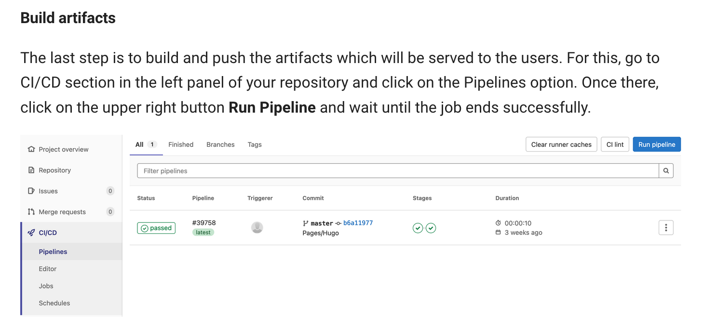

# How to create and manage an MkDocs website (like this one)

*Page by G. Gamba, G. Sterbini and N. Mounet*


## Introduction

The website content is hosted in the form of markdown files on [GitLab](https://gitlab.cern.ch/){target=_blank}. The MkDocs generator automatically can be used to generate the formatted website from the markdown file.

The website  is hosted by the CERN [web services](https://webservices.web.cern.ch/webservices/){target=_blank} and The [openshift](https://openshift.cern.ch/){target=_blank} cloud platform is used to automatically update the website when changes are made int he GitLab repository.

## Additional documentation

Detailed documentation can be found:

 - In the [CERN IT documentation for MkDocs websites](https://how-to.docs.cern.ch) 
 - In the official [MKdocs documentation](https://www.mkdocs.org)
 - In the documentation of the [material theme](https://squidfunk.github.io/mkdocs-material/) (see in particular the Setup section)

## How to create the website

To setup an MKDocs website, the steps proposed in the [CERN MkDocs documentation](https://how-to.docs.cern.ch) can be followed:

1. Create a GitLab repository. The easiest is to import an existing project as explained [here](https://how-to.docs.cern.ch/gitlabpagessite/create_site/creategitlabrepo/create_with_mkdocs/#a-import-project). The example proposed (https://gitlab.cern.ch/authoring/documentation/mkdocs-container-example.git) is fine.
2. Create a new project on webeos.cern.ch. To do so follow the instructions [here](https://how-to.docs.cern.ch/gitlabpagessite/create_site/create_webeos_project/). First create the project, then, staying in the `Administrator` view, go to **Operators -> Installed Operators**, then `Gitlab Pages Site Operator`. Make sure you are in the correct project, and to put the right url in `Host` (it is advised to end it with `.docs.cern.ch` for new sites) when you create the instance. If you made any mistake, you can modify after creation in the following way:
    - go to `Installed operators` again (make sure to be in the `Administrator` view),
    - click on `Publish a static site from a Gitlab repository (gitlab.cern.ch)` on the right,
    - click on the name of your project in the middle,
    - click on the `YAML` tab on top,
    - manually modify the YAML file (for instance, the host url is in `spec: host`).
3. Back on your gitlab repository, set up the Gitlab Pages by following the instructions [here](https://how-to.docs.cern.ch/gitlabpagessite/create_site/set_up_pages/).
4. Depending how you created your gitlab repository, you might need to follow the instructions about [building artefacts](https://how-to.docs.cern.ch/gitlabpagessite/create_site/creategitlabrepo/create_with_mkdocs/#build-artifacts), or creating a pipeline, or at least [running manually](https://how-to.docs.cern.ch/gitlabpagessite/create_site/creategitlabrepo/create_with_template/#build-artifacts) the pipeline the first time.

5. Optionally, restrict the website access to certain e-group using the instructions [here](https://how-to.docs.cern.ch/advanced/restricted_egroups/).

That should be it.

You can use [this website](http://abpcomputing.web.cern.ch) as a template. 

**Tip** *(from Sondre)*: To access advanced customization features you might have to pin the theme version by including "requirements.txt" file. See for example the [COMBI documentation website](https://combi.web.cern.ch). 

## Access from outside CERN
By default, your website is accessible only from within CERN. To make it accessible from the internet, you need to change the site visibility from "intranet" to "internet". This can be done in the section Access and Permission on the site management page (https://webservices.web.cern.ch -> manage my website -> select [your site]).

## How to edit the website

Te website can be edited:
  - Directly on GitLab, within the browser.
  - Locally, using git to clone the repository and push the modifications to GitLab. [Visual Studio Code](https://code.visualstudio.com), which is free and available on Windows, Linux and Mac, is convenient to do the editing, providing features like a spell checker and a realtime preview of the markdown rendering.


## Advanced features

### Run the website as a local server

It is quite slow to edit your pages on gitlab website or even locally, then pushing them to git, and let the OpenShift server recompile the website for you. It is possible to have a local version of the site compiled directly. To do so you need to intall MkDocs within a recent python installation (python 3.5 or later).

#### Install MkDocs
Mkdocs can be installed with pip:
```bash
pip install mkdocs
```

Then please install some additional mkdocs theme:
```bash
pip install mkdocs-material
```

If you are using the multi-language package i18n (as in the example provided on CERN gitlab: https://gitlab.cern.ch/authoring/documentation/mkdocs-container-example.git), then also install it:
```bash
pip install mkdocs-i18n
```

**Tip**: in this case, to get the  contents on the left translated properly, you might need to modify `mkdocs.yml` given in https://gitlab.cern.ch/authoring/documentation/mkdocs-container-example.git, replacing `nav_translations` by `translate_nav` (see [example](https://gitlab.com/mkdocs-i18n/mkdocs-i18n/-/blob/main/mkdocs.yml)).

#### Compile your website

Clone a local version of your repository 
```bash
git clone https://gitlab.cern.ch/abpcomputing/abpcpweb.git
```
Then move on the ```abpcpweb``` folder
```bash
cd abpcpweb
```
and start the ```mkdocs``` server by
```bash
mkdocs serve
```

You can now access the site on your browser at
http://127.0.0.1:8000/ .

You can also use another address (if e.g. this one is already in use) with e.g.
```bash
mkdocs serve --dev-addr 127.0.0.1:8001
```

Changes in the markdown files will be automatically propagated to the local version of the site. To stop the server, simply do Ctrl+c, or kill the process.

To update the version on the internet, you will need to commit and push your changes using git.

### Adding support for latex
1. activate mymdownx.arithmatex extension that is available by default in mkdocs container provided by CERN
2. I sugesst also to activate admonition extension (and eventually other pymdownx extensions) for a nicer website.
3. All this is done by adding the following lines in your mkdocs.yml configuration file:
```
markdown_extensions:
    - pymdownx.arithmatex
    - admonition

extra_javascript:
    - 'https://cdnjs.cloudflare.com/ajax/libs/mathjax/2.7.0/MathJax.js?config=TeX-MML-AM_CHTML'
```

If you want to add **local** MathJs, then you need to:
1. download to your repository the latest version of MathJax.
``
git clone https://github.com/mathjax/MathJax.git
``
2. add everything inside your *docs* folder, e.g. under
``
docs/js/MathJax-2.7.5
``
3. replace the *extra_javascript:* configuration as following:
```
extra_javascript:
    - 'js/MathJax-2.7.5/MathJax.js?config=TeX-MML-AM_CHTML'
```


### Using different branch

1. Edit your "build" YAML configuration file on openshift:


