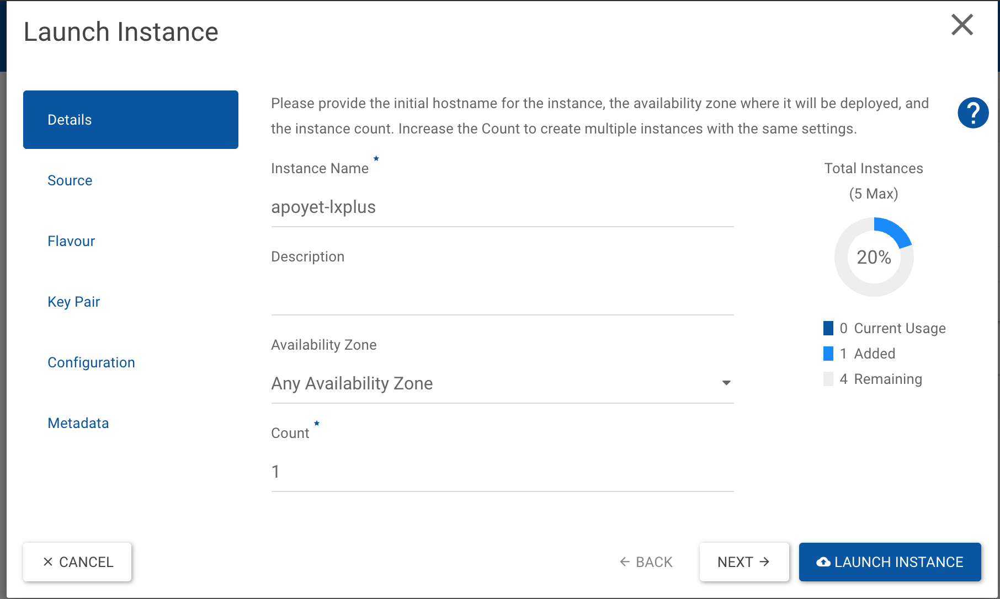
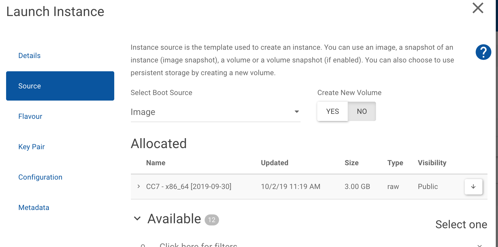
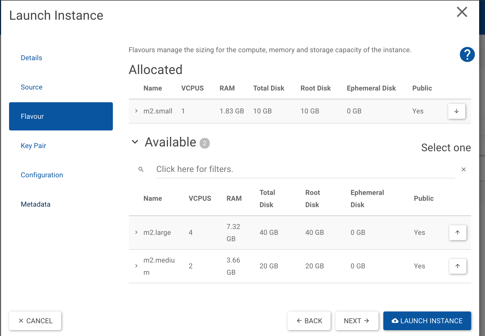
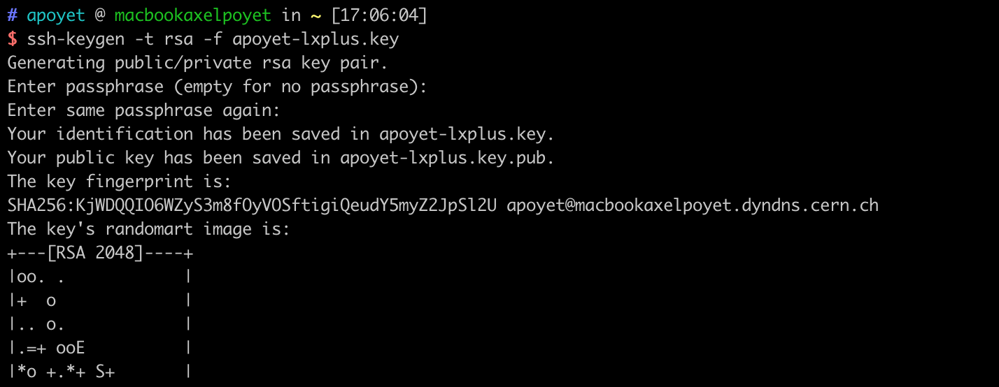
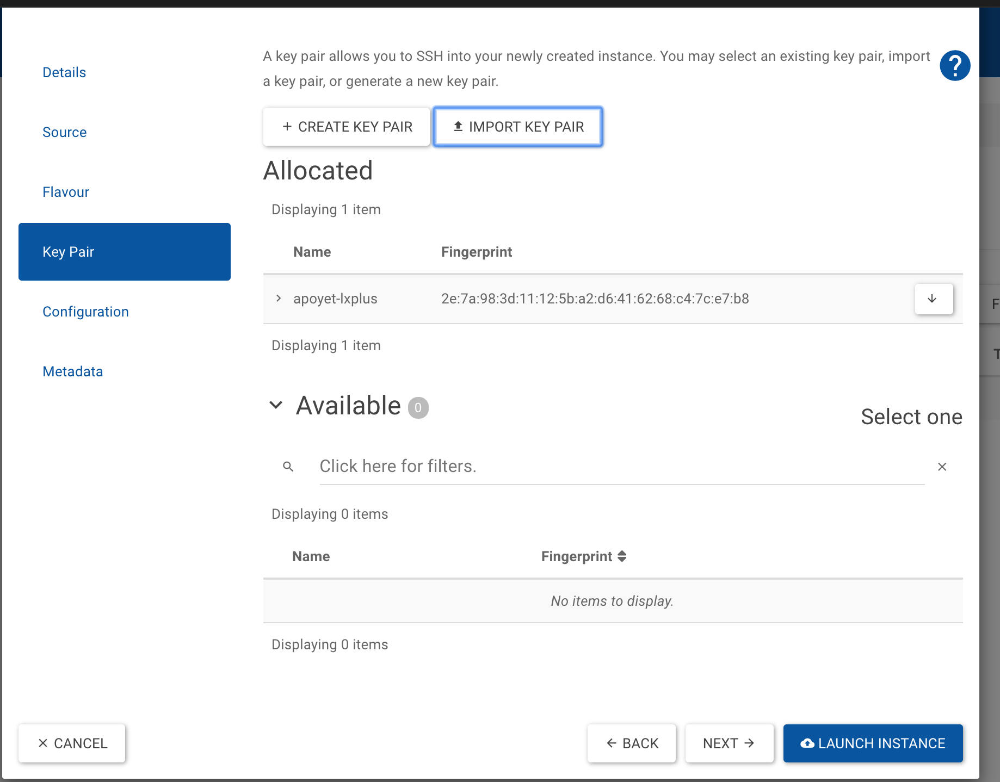

# Creating a CentOS C7 Virtual Machine

*(Prepared by A. Poyet)*

### Step 1 : Create a new OpenStack instance

The first step is to create an instance using the [OpenStack](https://openstack.cern.ch/){target=_blank} service at CERN. From this website, click on 'Instances'.

#### Set the details of your machine

Simply choose a name that will be convenient for you. 


#### Choose a source

We recommend to choose as source an image of the CC7 OS. 


#### Choose a flavour

Here you can choose the number os CPUs, and memory you need, choosing between three possible sizes (small, medium large). For a fast creation, we recommend to request a small one.




#### Create a key pair

In order to access your machine by ssh, you need to create (actually import) a key pair. For that, go to your terminal and issue the following command:

```bash
ssh-keygen -t rsa -f apoyet-lxplus.key
```

*NB: apoyet-lxplus.key corresponds here to the name of the key I'm creating*



Now import the key pair in your instance by clicking on 'IMPORT KEY PAIR' and copy pasting the public key you just created



And launch your instance (~20 min).

### Step 2: Access your machine

Once the instance is running, you should be able to access it via ssh as root: 

```bash
ssh -i apoyet-lxplus.key root@apoyet-lxplus
```

It seems that a user corresponding to your NICE account is already created. 

```bash
ssh apoyet-lxplus
```

And AFS is already mounted. 

### Step 3: Mount CVMFS

Access your machine as root. And issue: 

```bash
locmap --enable cvmfs
locmap --configure cvmfs
```

### Step 4: Mount EOS

Access your machine as root. And issue: 

```bash
locmap --enable eosclient
locmap --configure eosclient
```
Once connected as user on your machine, you will need to create a token to access EOS. This is done by issuing two commands:

```bash
kinit
aklog
```

You can install **git** with
```
sudo yum install git
```

You can install **jvm** with
```
sudo yum install java-1.8.0-openjdk
```
This will be useful for [pytimber](https://github.com/rdemaria/pytimber){target=_blank} and other codes. 


You can also install the [standard development tools](https://linux.web.cern.ch/linux/centos7/docs/softwarecollections.shtml){target=_blank}, for example,
```
sudo yum install centos-release-scl
sudo yum install devtoolset-8
```
to help standard compilations.
