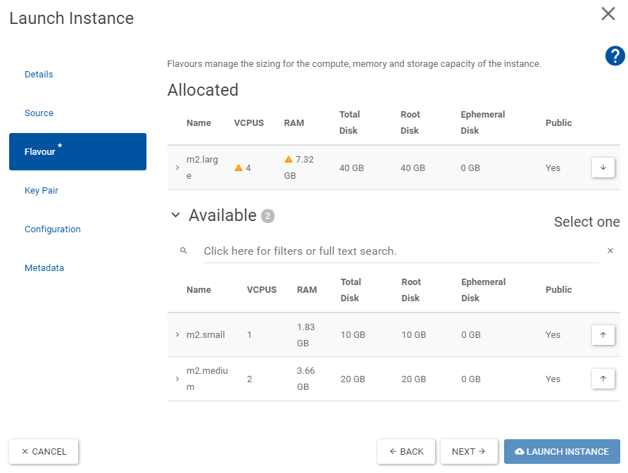

# Virtual Machine CentOS Stream 8

This guide is very similar to [Creating a CentOS CC7 Virtual Machine](openstackCC7.md),
yet focuses on the [CentOS Stream 8 image](https://linux.web.cern.ch/centos8/), which comes with less pre-configuration, than CC7.

After this guide you will have a virtual CentOS Stream 8 machine, with `afs`, `eos` and `htcondor` enabled.

## Create SSH Key pair

Create an ssh-public-private-key pair for authentication.

```bash
ssh-keygen -t rsa -f your-key-name
```

where `your-key-name` is the name you want to give your key, e.g. `centos8key`. 
The keys will be saved in `~/.ssh/`.


## Create virtual machine

Go to [CERN Openstack](https://openstack.cern.ch/): `Project -> Compute -> Instaces -> Launch Instance`

 - On **Details** choose a cern-unique name for your instance. 
It will be available under `your-instance-name@cern.ch` 


- On **Source** select the `CS8_x86_64` image


- On **Flavour** select the Volume and RAM size that you think you will need.


- On **Key Pair** select _Import Key Pair_ and choose as `ssh-key` the in [Step 1 created **Public Key**](#create-ssh-key-pair), e.g. `centos8key.pub`.


Now you have to wait until your instance is created, you can see the progress in the `Project -> Compute -> Instances` view.
When the **Power State** reads _Running_ your machine is ready.


## Create new User

Unlike in CC7 only the `root` user will be created.

 - Login to your virtual machine as this user via ssh:   
   ```bash
   ssh -i your-key-name root@your-machine-name.cern.ch
   ```   
   where `your-key-name` from the examples above would be `centos8key` and 
   `your-machine-name` would be `mycentoscs8`.


- Create user with the same name as your cern name with sudo rights:
  ```bash
  export USERNAME=your-cern-username
  adduser $USERNAME
  passwd $USERNAME
  usermod -aG wheel $USERNAME
  ```
  The password does not need to match your CERN password.


- Allow ssh-authorization for this user for the same ssh-keys
  ```bash
  mkdir /home/$USERNAME/.ssh
  cp .ssh/authorized_keys /home/$USERNAME/.ssh/
  chown -R $USERNAME:$USERNAME /home/$USERNAME/.ssh/
  ```

**And you're done.** <br> 
You will probably never use this `root` user again.
So log out now.


And you should now be able to login as: 
```bash
ssh -i your-key-name your-user-name@your-machine-name.cern.ch
```


!!! warning "Disable SSH-Root-Login"

    For security reasons it might make sense now to **deactivate ssh-login via root-user account**.
    Before you do this, **make sure you can login as your-user-name and you have root-rights** (e.g. `sudo su` works).
    You can now disallow login as root by modifying (with `sudo`) the line in `/etc/ssh/sshd_config`<br>
    ```bash
    PermitRootLogin yes
    ```
    to
    ```bash
    PermitRootLogin no
    ```
    and restart the ssh daemon
    ```shell
    systemctl restart sshd
    ```


!!! note "SSH Config"

    To make your life easier you can add the following lines to your ssh-config `~/.ssh/config`:
    ```bash
    # connect to virtual machine from inside GPN
    Host *your-machine-name
      HostName your-machine-name.cern.ch
      User your-user-name
      IdentityFile path/to/your-ssh-key-name

    # connect through proxy from outside GPN
    Host ext*
       ProxyJump lxtunnel.cern.ch
    ```

    with the `your-xxxx-name`s replaced accordingly.
    This allows you to ssh into your machine simply with

    === "inside GPN"

        ```shell
        ssh your-machine-name
        ```

    === "outside GPN"

        ```shell
        ssh extyour-machine-name
        ```

## Install afs/eos/etc.

This follows the installation hints found on the [CERN centos step-by-step installation guide](https://linux.web.cern.ch/centos8/docs/stepbystep/).

First install `locmap` which manages CERN installations and then let it install and reconfigure the CERN-default packages:

```bash
sudo dnf install locmap-release
sudo  dnf install locmap
for module in afs eosclient chrony cvmfs kerberos lpadmin postfix ssh sudo; do sudo locmap --enable $module; done
sudo locmap --configure all
```

Now you should have access to `afs`, `eos` and `kerberos` (`kinit` and `aklog`).


## Install HTCondor

This is adapted from the [HTCondor installation guide](htcondor.md) on this webpage, but with some modifications. 
First of all we don't need to install the `kerberos` packages, as this is done by `locmap` in the [step above](#install-afseosetc).

### Configure `KERBEROS`
We only need to configure `kerberos` for HTCondor:

```
export USERNAME=your-user-name

scp $USERNAME@lxplus8.cern.ch:/usr/bin/batch_krb5_credential .
chmod +x batch_krb5_credential
sudo mv batch_krb5_credential /usr/bin/

scp $USERNAME@lxplus8.cern.ch:/etc/ngauth_batch_crypt_pub.pem .
sudo mv ngauth_batch_crypt_pub.pem /etc/

scp $USERNAME@lxplus8.cern.ch:/etc/krb5.conf.no_rdns .
sudo mv krb5.conf.no_rdns /etc/krb5.conf.no_rdns 

scp $USERNAME@lxplus8.cern.ch:/etc/sysconfig/ngbauth-submit .
sudo mv ngbauth-submit /etc/sysconfig/
```

verify the installation via:

```shell
/usr/bin/batch_krb5_credential
```

There should be an output like: 

```shell
-----BEGIN NGAUTH COMPOSITE-----
# LOTS OF LINES OF YOUR KEY
-----END NGAUTH COMPOSITE-----
```

and nothing else (i.e. no missing files or errors).
Make sure you have valid credentials already (run `kinit`).
Also see [the debugging help](htcondor.md#debugging-the-kerberos-installation).

### Install `HTCondor` 
This follows the guide in the [develop branch on the HTCondor website](https://research.cs.wisc.edu/htcondor/instructions/el/8/development/).
The development brach is needed for now as [CERN requires HTCondor `v8.9.7+`](https://cern.service-now.com/service-portal?id=outage&n=OTG0064093) as of June 2021.

```batch
sudo yum install wget

sudo wget https://research.cs.wisc.edu/htcondor/yum/RPM-GPG-KEY-HTCondor
sudo rpm --import RPM-GPG-KEY-HTCondor 

cd /etc/yum.repos.d
sudo wget https://research.cs.wisc.edu/htcondor/yum/repo.d/htcondor-development-rhel8.repo

sudo yum install condor-all
```

### Configure `HTCondor`
The configuration is then as in the [default HTCondor guide](htcondor.md#configure-htcondor).

- Create the config file `/etc/condor/config.d/10-local.config`.
  Please set as scheduler (`SCHEDD_HOST`) the default one you get on `lxplus`, e.g. in your `condor_q` output.
  You can also find it out by running (on `lxplus`):
  ```shell
  condor_config_val SCHEDD_HOST
  ```
  An example content is provided here:
  ```bash
  CONDOR_HOST = tweetybird03.cern.ch, tweetybird04.cern.ch
  COLLECTOR_HOST = tweetybird03.cern.ch, tweetybird04.cern.ch
  SCHEDD_HOST = bigbirdXX.cern.ch
  SCHEDD_NAME = $(SCHEDD_HOST)
  SEC_CLIENT_AUTHENTICATION_METHODS = KERBEROS
  SEC_CREDENTIAL_PRODUCER = /usr/bin/batch_krb5_credential
  CREDD_HOST = $(SCHEDD_HOST)
  FILESYSTEM_DOMAIN = cern.ch
  UID_DOMAIN = cern.ch
  ```

- Start the service:
  ```
  sudo systemctl start condor
  sudo systemctl enable condor
  ```

- Check:
  ```
  condor_q
  ```
  See [the debugging help](htcondor.md#debugging-the-htcondor-configuration).


**Congratulations! You have now a very lxplus-like machine at your own disposal.**
  
